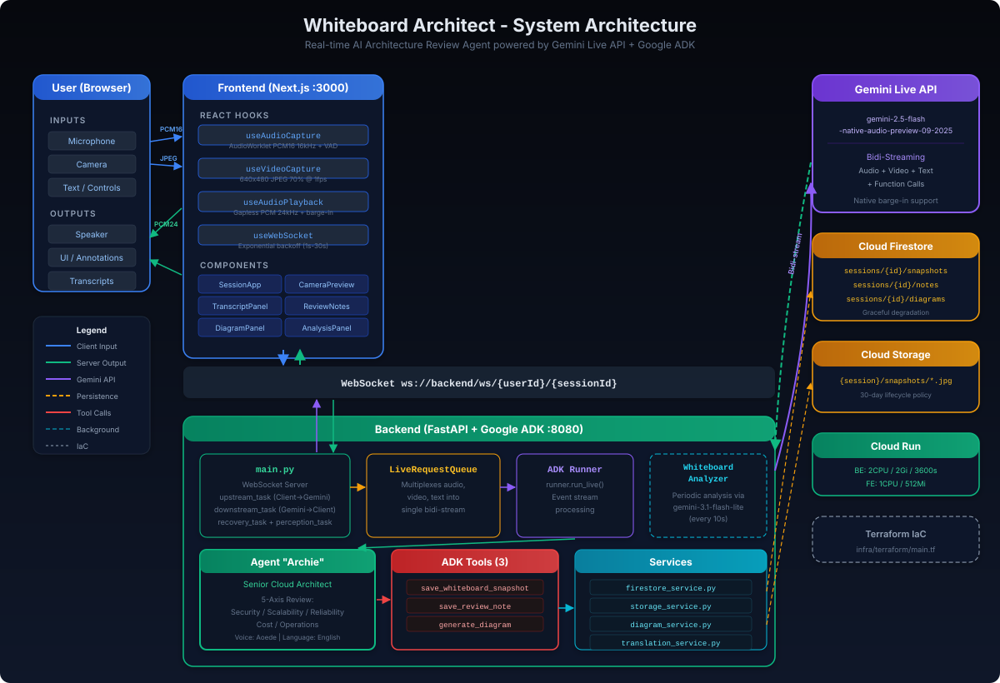

# Whiteboard Architect

> Gemini Live API を活用した、リアルタイム AI アーキテクチャレビューエージェント

**カテゴリ**: Live Agents | **ハッカソン**: [Gemini Live Agent Challenge](https://geminiliveagentchallenge.devpost.com/)

[English README](./README.md)

---

## 課題

ホワイトボードを使ったアーキテクチャ設計セッションはソフトウェア開発の基盤ですが、その場で専門家のレビューを受けることは困難です。設計上の欠陥、セキュリティの隙間、スケーラビリティの問題は、開発サイクルのずっと後になって初めて発覚することが多く、そのときには修正コストが大幅に増大しています。

## ソリューション

**Whiteboard Architect** は、AI シニアアーキテクト **Archie（アーチー）** をすべてのホワイトボードセッションに参加させます。カメラを通じて図を**見て**、あなたの説明を**聞き**、リアルタイムに音声で**フィードバック**します。まるで経験豊富な同僚が隣で見守っているかのような体験です。

---

## 主要機能

| 機能 | 説明 |
|---|---|
| **リアルタイム映像分析** | カメラを通じてホワイトボードを継続的に監視し、描かれた図を理解する |
| **自然な音声会話** | アーキテクチャの決定について自然に会話できる。タイピング不要 |
| **バージイン（割り込み）** | AIの発話中に割り込み可能。実際の人間と話すように自然 |
| **5軸アーキテクチャレビュー** | セキュリティ、スケーラビリティ、信頼性、コスト、運用の5観点で即座にフィードバック |
| **視覚アノテーション** | AIがホワイトボード上の特定箇所を丸、矢印、四角、ラベルでハイライト |
| **バックグラウンド分析** | Gemini 3 Flash による定期的なホワイトボードの深層分析 |
| **自動ダイアグラム生成** | 手描きのホワイトボードスケッチをプロフェッショナルな技術図に変換 |
| **レビューノート** | 発見事項を重要度別・カテゴリ別に自動記録し、改善推奨を提示 |
| **スナップショット履歴** | ホワイトボードの重要な状態をタイムスタンプ付きで保存 |
| **セッションサマリー** | レーダーチャートによる可視化 + Markdown エクスポート |

---

## アーキテクチャ



<details>
<summary>テキスト版アーキテクチャ概要</summary>

```
Frontend (Next.js :3000)
  +-- useWebSocket      --> ws://backend/ws/{userId}/{sessionId}
  +-- useAudioCapture   --> PCM16 16kHz --> base64 --> WS
  +-- useVideoCapture   --> JPEG 1fps --> base64 --> WS
  +-- useAudioPlayback  <-- PCM 24kHz <-- WS

Backend (FastAPI + Google ADK :8080)
  +-- WS /ws/{user_id}/{session_id}
  |     +-- upstream_task   : WS --> LiveRequestQueue --> Gemini Live API
  |     +-- downstream_task : Gemini Live API --> WS
  |     +-- WhiteboardAnalyzer : 定期的深層分析 (Gemini 3 Flash)
  +-- ADK Runner
  |     +-- agent.py: architect_agent ("Archie")
  |           +-- tools: save_whiteboard_snapshot, save_review_note,
  |                      add_annotation, generate_diagram
  +-- GET /health
  +-- GET /api/sessions/{id}/notes
  +-- GET /api/sessions/{id}/snapshots

Google Cloud
  +-- Cloud Run     : Backend + Frontend ホスティング (セッションアフィニティ)
  +-- Firestore     : sessions/{id}/snapshots, sessions/{id}/notes
  +-- Cloud Storage : {bucket}/{session_id}/snapshots/{timestamp}.jpg
```
</details>

[`docs/`](./docs/) ディレクトリに追加の図があります:

- [データフロー図](./docs/data-flow.svg) -- フォーマット詳細を含むエンドツーエンドのデータフロー
- [シーケンス図](./docs/data-flow-sequence.svg) -- メッセージレベルのやり取り（セッション開始、会話、バージイン、ツール呼び出し、変化検出）
- [デプロイメントパイプライン](./docs/deployment-pipeline.svg) -- 6フェーズの deploy.sh パイプラインと Terraform リソース

---

## 技術スタック

| レイヤー | テクノロジー |
|---|---|
| フロントエンド | Next.js 15 (React 19), Tailwind CSS v4 |
| バックエンド | Python 3.11+ (FastAPI, Uvicorn) |
| AI エージェントフレームワーク | Google ADK (Agent Development Kit) |
| AI モデル | Gemini 2.5 Flash Native Audio (Live API) |
| バックグラウンド分析 | Gemini 3 Flash Preview |
| データベース | Google Cloud Firestore |
| オブジェクトストレージ | Google Cloud Storage |
| ストリーミングプロトコル | WebSocket（双方向） |
| ホスティング | Google Cloud Run |
| インフラ | Terraform (IaC) |
| コンテナ | Docker, Docker Compose |

---

## 前提条件

- **Python** 3.11 以上
- **Node.js** 18 以上
- **Docker** および **Docker Compose**（推奨）
- [Google AI Studio](https://aistudio.google.com/) から取得した **Gemini API キー**
- （クラウド機能利用時）課金が有効な **Google Cloud プロジェクト**

---

## クイックスタート

### 1. リポジトリのクローン

```bash
git clone https://github.com/buddypia/whiteboard-architect.git
cd whiteboard-architect
```

### 2. 環境変数の設定

```bash
cp .env.example .env
# .env を編集 -- 最低限 GOOGLE_API_KEY を設定
```

### 3. Docker Compose で起動（推奨）

```bash
docker-compose up --build
```

### 4. または個別に起動

**方法A: ルートから両方同時起動**

```bash
npm install && npm run dev
```

**方法B: 各サービスを個別起動**

```bash
# ターミナル1 - バックエンド
cd backend
pip install -r requirements.txt
python main.py
# --> http://localhost:8080

# ターミナル2 - フロントエンド
cd frontend
npm install
npm run dev
# --> http://localhost:3000
```

### 5. アプリを開く

ブラウザで `http://localhost:3000` にアクセスします。カメラとマイクのアクセスを許可し、ホワイトボードにカメラを向けてアーキテクチャについて話し始めましょう!

---

## 動作に関する注意事項

- 本プロジェクトは `GOOGLE_API_KEY` による Gemini API を使用しています。Vertex AI は不要です。
- ライブオーディオモデルは `gemini-2.5-flash-native-audio-preview-09-2025` に固定されています。
- 起動時にバックエンドが設定されたモデル候補をプローブし、Live API + ツール呼び出しパスに失敗するバリアントを自動的に除外します。
- Firestore と Cloud Storage はオプションです。利用できない場合はインメモリストレージにフォールバックし、ローカル開発が完全に機能します。

---

## クラウドデプロイ

### Terraform による自動デプロイ（推奨）

```bash
cd infra/terraform
cp terraform.tfvars.example terraform.tfvars  # project_id と region を設定
terraform init
terraform apply
```

### deploy.sh による自動デプロイ

```bash
./deploy.sh --project YOUR_PROJECT_ID --region us-central1
```

6フェーズのパイプラインを実行します: セットアップ --> インフラ --> バックエンドビルド --> バックエンドデプロイ --> フロントエンドビルド --> フロントエンドデプロイ。

### 手動デプロイ

```bash
# バックエンドを Cloud Run にデプロイ
cd backend
gcloud run deploy whiteboard-architect-backend \
  --source . \
  --region us-central1 \
  --allow-unauthenticated
```

---

## 使い方

1. **ホワイトボードを準備** -- 物理的なホワイトボード、紙、またはタブレットをカメラの前に置きます。
2. **セッションを開始** -- 「Start Session」をクリックしてカメラとマイクのキャプチャを開始します。
3. **描きながら話す** -- システムアーキテクチャをスケッチしながら、設計判断について説明します。
4. **フィードバックを受ける** -- Archie がリアルタイムで図を分析し、以下について音声フィードバックを提供します:
   - セキュリティの脆弱性
   - スケーラビリティの懸念
   - 単一障害点（SPOF）
   - コスト最適化の機会
   - 運用上のベストプラクティス
5. **視覚アノテーション** -- Archie がホワイトボード上の特定箇所を視覚マーカーでハイライトします。
6. **ダイアグラム生成** -- 「図解して」「きれいな図にして」と依頼すると、手描きスケッチがプロフェッショナルな技術図に変換されます。
7. **レビューノート** -- Review Notes パネルで重要度別に分類された発見事項を確認します。
8. **エクスポート** -- セッション終了時にレーダーチャートと Markdown エクスポート付きのサマリーを取得します。

---

## プロジェクト構成

```
gemini-live-agent-challenge/
+-- README.md                    # 英語版 README
+-- README.ja.md                 # 日本語版 README（本ファイル）
+-- CLAUDE.md                    # AI 開発コンテキスト
+-- docker-compose.yml           # ローカル開発セットアップ
+-- package.json                 # ルートスクリプト（concurrent dev）
+-- deploy.sh                    # 6フェーズデプロイスクリプト
|
+-- frontend/                    # Next.js フロントエンドアプリ
|   +-- src/
|   |   +-- app/                 # Next.js App Router
|   |   +-- components/          # React コンポーネント
|   |   |   +-- SessionApp.tsx   #   メインオーケストレーター
|   |   |   +-- CameraPreview    #   カメラ + アノテーションオーバーレイ
|   |   |   +-- TranscriptPanel  #   会話トランスクリプト
|   |   |   +-- ReviewNotesPanel #   カテゴリ別レビューノート
|   |   |   +-- DiagramPanel     #   生成ダイアグラム表示
|   |   |   +-- SessionSummary   #   レーダーチャート + エクスポート
|   |   +-- hooks/               # カスタム React Hooks
|   |   |   +-- useWebSocket     #   WS + 指数バックオフ
|   |   |   +-- useAudioCapture  #   AudioWorklet PCM16 16kHz
|   |   |   +-- useAudioPlayback #   ギャップレス PCM + バージイン
|   |   |   +-- useVideoCapture  #   JPEG キャプチャ @ 1fps
|   |   +-- lib/                 # ユーティリティと型定義
|   +-- public/
|   +-- Dockerfile
|
+-- backend/                     # Python バックエンドサービス
|   +-- main.py                  # FastAPI + WebSocket サーバー
|   +-- agent.py                 # ADK エージェント定義 (Archie)
|   +-- config.py                # 環境設定
|   +-- tools/
|   |   +-- architect_tools.py   # 4つの ADK ツール
|   +-- services/
|   |   +-- firestore_service.py # Firestore 永続化
|   |   +-- storage_service.py   # GCS スナップショット保存
|   |   +-- diagram_service.py   # ダイアグラム生成
|   |   +-- whiteboard_analyzer.py # バックグラウンド分析
|   +-- Dockerfile
|
+-- infra/                       # Infrastructure as Code
|   +-- terraform/
|       +-- main.tf              # 全 GCP リソース
|       +-- variables.tf
|       +-- outputs.tf
|
+-- docs/                        # ドキュメントと図
    +-- architecture-diagram.svg # システムアーキテクチャ
    +-- data-flow.svg            # データフロー図
    +-- data-flow-sequence.svg   # シーケンス図
    +-- deployment-pipeline.svg  # デプロイメントパイプライン
```

---

## WebSocket プロトコル

### クライアント --> サーバー（`ClientMessage`）

| タイプ | ペイロード | 説明 |
|---|---|---|
| `audio` | `{type: "audio", data: "<base64>"}` | PCM16 16kHz マイク音声 |
| `video` | `{type: "video", data: "<base64>"}` | JPEG カメラフレーム (1fps) |
| `text` | `{type: "text", text: "..."}` | テキスト入力 |
| `control` | `{type: "control", action: "save_snapshot"}` | 制御コマンド |

### サーバー --> クライアント（`ServerMessage`）

| タイプ | ペイロード | 説明 |
|---|---|---|
| `audio` | `{type: "audio", data: "<base64>"}` | PCM 24kHz AI 音声 |
| `transcript` | `{type: "transcript", role, text}` | 音声テキスト変換 |
| `interrupted` | `{type: "interrupted"}` | バージイン検出 |
| `turn_complete` | `{type: "turn_complete"}` | AI 発話完了 |
| `tool_call` | `{type: "tool_call", name, result}` | ツール実行結果 |
| `annotation` | `{type: "annotation", id, x, y, ...}` | 視覚マーカー（30秒で自動消去） |
| `agent_state` | `{type: "agent_state", mood, trigger}` | エージェント感情状態 |
| `diagram` | `{type: "diagram", svg, title}` | 生成ダイアグラム |
| `analysis` | `{type: "analysis", ...}` | バックグラウンド分析結果 |

---

## 学んだこと

- **Gemini Live API による双方向ストリーミング** -- 音声、映像、テキストの双方向ストリーミングを WebSocket 上で実装するには、upstream（クライアント --> Gemini）と downstream（Gemini --> クライアント）の2つの並列非同期タスクによる慎重な設計が必要でした。`LiveRequestQueue` が音声フレームと映像フレームのシームレスな多重化の鍵となりました。

- **ADK によるネイティブバージイン** -- Google ADK と Live API の組み合わせにより、カスタムコードなしでネイティブなバージインがサポートされます。ユーザーが話し始めると AI の音声出力が自動的に中断され、`interrupted` イベントがクライアントに送信されます。フロントエンドで AudioContext バッファを即座にクリアすることで、自然な割り込み体験を実現しています。

- **ネイティブオーディオモデルの言語処理** -- `gemini-2.5-flash-native-audio-preview` は日本語の音声入出力をサポートしていますが、システムプロンプトで明示的にターゲット言語を強制しないと英語で応答する傾向があります。音声認識精度は発話速度や周囲の騒音にも影響されます。

- **グレースフルデグレード** -- クラウドサービス（Firestore, GCS）はオプションとして設計されています。起動時に可用性を確認し、利用できない場合はインメモリストレージにフォールバックします。これにより、Gemini API キー以外のクラウド認証情報なしで完全に機能するローカル開発が可能です。

---

## 使用技術

- **[Gemini Live API](https://ai.google.dev/gemini-api/docs/live)** -- 映像、音声、関数呼び出しを備えたリアルタイム双方向ストリーミング
- **[Google ADK](https://google.github.io/adk-docs)** -- ツール付き AI エージェント構築のための Agent Development Kit
- **[Google Cloud Run](https://cloud.google.com/run)** -- セッションアフィニティ対応のサーバーレスコンテナホスティング
- **[Cloud Firestore](https://cloud.google.com/firestore)** -- セッション履歴用 NoSQL データベース
- **[Cloud Storage](https://cloud.google.com/storage)** -- ホワイトボードスナップショット用オブジェクトストレージ
- **[Next.js](https://nextjs.org/)** -- フロントエンド用 React フレームワーク
- **[Terraform](https://www.terraform.io/)** -- 自動プロビジョニングのための Infrastructure as Code

---

## ライセンス

MIT

---

[Gemini Live Agent Challenge](https://geminiliveagentchallenge.devpost.com/) のために構築。 #GeminiLiveAgentChallenge
